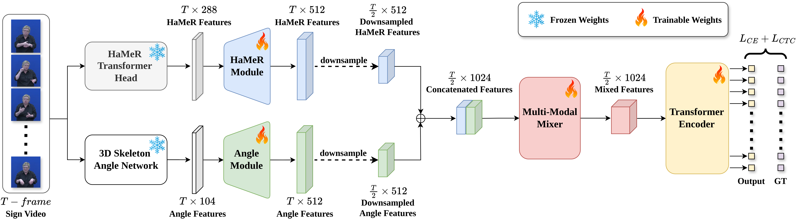

# [Hands-On: Segmenting Individual Signs from Continuous Sequences [Sign Language Segmentation @ FG25]](https://ieeexplore.ieee.org/stamp/stamp.jsp?arnumber=11099255)
  [](https://ieeexplore.ieee.org/stamp/stamp.jsp?arnumber=11099255) 


Welcome to the official repository for **Hands-On**, our Sign Language Segmentation model. In response to strong interest and popular demand from the research community, we are thrilled to make this codebase publicly available!

### Important Notes on Usage

* **Custom Data:** If you are processing your own sign language videos, you will need to manually convert your raw HaMeR and 3D angle inputs to match the provided examples.

* **Future Support & FAST:** Comprehensive data conversion scripts are omitted, as this pipeline is being deprecated in favor of our next-generation model, **FAST**. Featuring a streamlined uni-modal design and 6D data representations, FAST will be fully released upon the acceptance of [SignSpark](https://arxiv.org/pdf/2603.10446).

## 🚀 QuickStart (Tested on RTX3090 & RTX5090)
- Install conda environment: 
```
conda env create -f environment.yml
```

## 📥 Download Weights and Data

Our pre-trained model checkpoints and example datasets are hosted on Google Drive. 

* **[Download Inference Utils (Google Drive)](https://drive.google.com/drive/u/1/folders/1OODW4RcqhA_RtmHhGKAkm7Gk2zKVcfG5)**

Once downloaded, extract the ZIP archives and place the extracted folders into the `inference_utils` directory. Your project tree should look exactly like this:

```text
inference_utils/
├── csldaily_exp/
└── handson_ckpt/
```

## ⚙️ Performing Inference on the Model

To generate predictions using the pre-trained model, run the following command. This example demonstrates how to run inference using the provided CSLDaily sample data:

```bash
python __main__.py inference_hamer \
./config/Hamer_Inference_Config.yaml \
--hamer_input ./inference_utils/csldaily_exp/HaMeR/S000001_P0008_T00.lzma \
--angle_input ./inference_utils/csldaily_exp/Skeleton/S000001_P0008_T00_uplift.pt \
--pred_save_path annotations.pt
```

## 🧰 Custom Data Extraction

While the full end-to-end data pipeline is deprecated, we provide the several utilities to help you process and format custom sign language data for sign segmentation inference.

### 1. HaMeR Features
We provide a dedicated script (`./data_prep/Extract_HaMeR_Single.py`), adapted from the HaMeR demo, to ensure your inputs are correctly extracted into the required `.lzma` format.

1. Clone the [official HaMeR repository](https://github.com/geopavlakos/hamer) and complete their environment setup.
2. Run `./data_prep/Extract_HaMeR_Single.py` within the HaMeR environment to extract your features.

### 2. 3D Skeletons

For 3D skeleton extraction, we employ the methodology introduced in [*Improving 3D Pose Estimation for Sign Language*](https://arxiv.org/abs/2308.09525). If you utilize this pipeline in your research, please cite their original paper.

1. Clone the [Skeleton 3D Uplift repository](https://github.com/ivashmak/skeleton_3d_uplift) and follow their provided setup instructions.
2. Process your `.mp4` videos through their pipeline to generate the required `.pt` files.
3. These resulting `.pt` files are natively compatible with **Hands-On** and can be used directly as inputs without any additional preprocessing.

## 🖊️ Citation
If you find **Hands-On** useful, please consider citing our work: 

```bibtex
@inproceedings{he2025hands,
  title={Hands-on: Segmenting individual signs from continuous sequences},
  author={He, Low Jian and Walsh, Harry and Sincan, Ozge Mercanoglu and Bowden, Richard},
  booktitle={2025 IEEE 19th International Conference on Automatic Face and Gesture Recognition (FG)},
  pages={1--5},
  year={2025},
  organization={IEEE}
}

